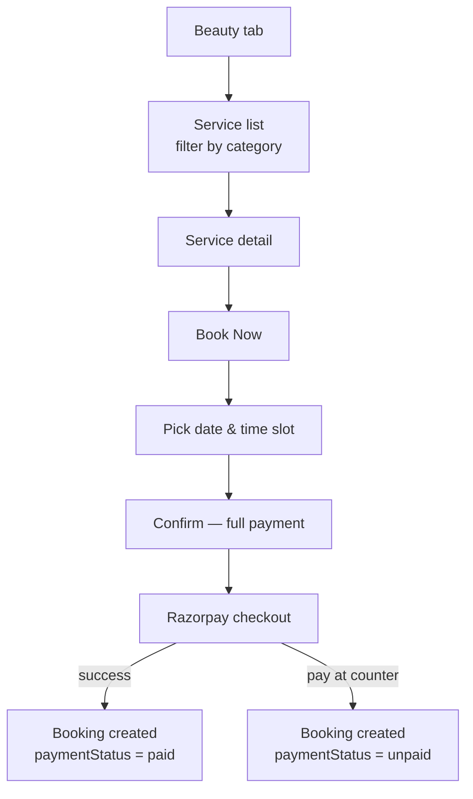
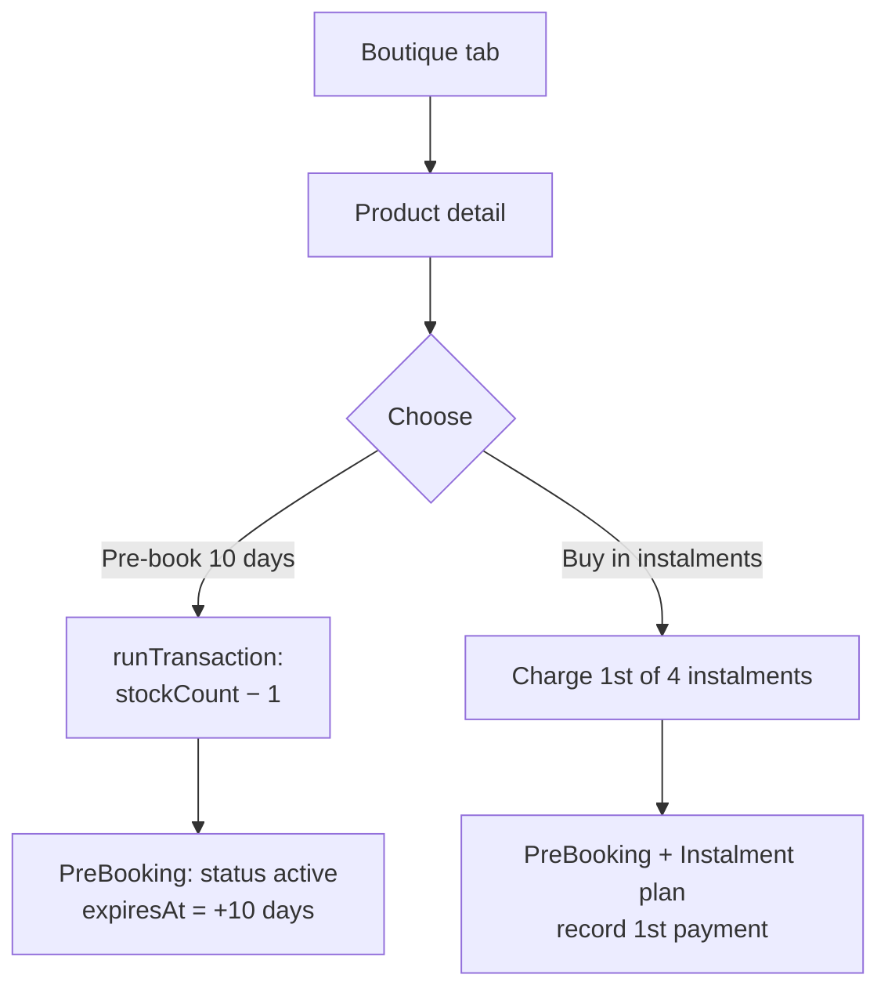
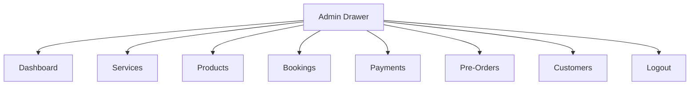
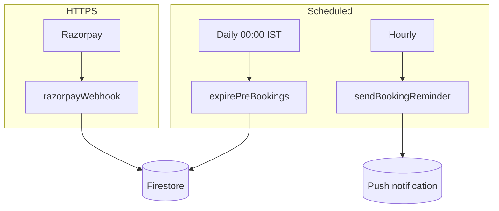
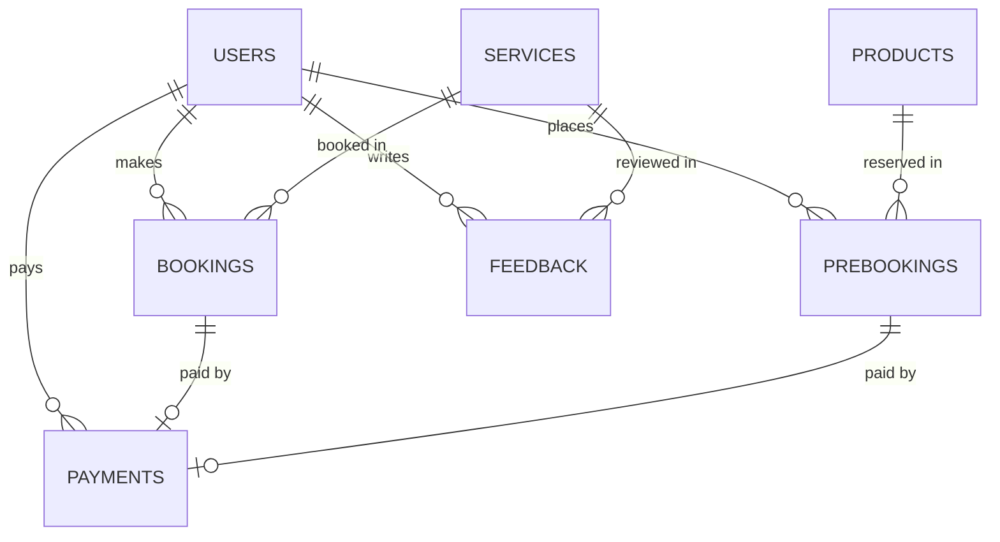
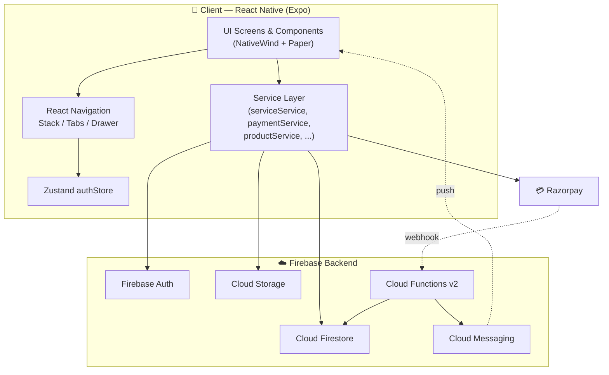
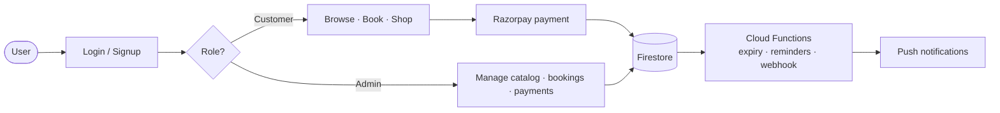

# Glamour — Beauty Parlour & Boutique Management App

### Project Report

| | |
|---|---|
| **Project Title** | Glamour — Beauty Parlour & Boutique Management Application |
| **Application Type** | Cross-platform Mobile + Web Application |
| **Platforms** | Android · iOS · Web (single React Native codebase) |
| **Frontend** | React Native (Expo) + TypeScript |
| **Backend** | Firebase (Auth · Firestore · Storage · Cloud Functions) |
| **Payment Gateway** | Razorpay |
| **Repository** | https://github.com/HARSHU101106/beauty_parlur_and_botique_app |
| **Version** | 1.0.0 |
| **Report Date** | June 2026 |

---

## Table of Contents

1. [Existing System](#1-existing-system)
2. [Proposed System](#2-proposed-system)
3. [Requirements (Software & Hardware)](#3-requirements-software--hardware)
4. [Project Modules](#4-project-modules)
5. [Working Diagram](#5-working-diagram)
6. [Output Screenshots](#6-output-screenshots)

---

## 1. Existing System

In the current manual setup, a beauty parlour and boutique business is operated
**offline / on paper**, which leads to several limitations:

- **Manual booking** — Customers must call or visit in person to book a service.
  There is no view of available time slots, leading to overbooking and clashes.
- **Paper registers** — Bookings, customer details, and payments are recorded in
  notebooks, which are easy to lose and hard to search.
- **No online catalog** — Customers cannot browse the list of services or boutique
  products with prices before visiting the shop.
- **Cash-only payments** — Payments are collected manually; there is no online
  payment, no instalment facility, and no digital receipt.
- **No stock tracking** — Boutique product stock is counted by hand, so items often
  get oversold or go out of stock without notice.
- **No reminders** — Customers are not reminded about upcoming appointments, which
  increases no-shows.
- **No customer history** — The owner cannot easily see a customer's past bookings,
  purchases, or feedback.

**Drawbacks of the existing system**

| Problem | Impact |
|---|---|
| Manual booking by phone/visit | Time-consuming, slot clashes |
| Paper records | Data loss, no quick search |
| No online catalog | Customers unaware of services/prices |
| Cash-only | No instalments, no digital proof |
| Manual stock count | Overselling, stock errors |
| No reminders | Frequent no-shows |

---

## 2. Proposed System

The proposed system is **"Glamour"**, a single application (mobile + web) that
**digitises the entire parlour and boutique workflow** with two roles —
**Customer** and **Admin**.

**What the proposed system provides**

- **Online service booking** with date and time-slot selection, avoiding clashes.
- **Digital catalogs** for beauty services and boutique products, split for
  **women** and **kids**, with images and prices.
- **Online payments via Razorpay** — full payment for services, and **pre-booking**
  (10-day hold) or a **4-part instalment plan** for boutique products.
- **Automatic stock management** — product stock reduces in a safe transaction when a
  product is pre-booked, preventing overselling.
- **Automatic pre-booking expiry** and **appointment reminders** through scheduled
  Cloud Functions and push notifications.
- **Customer history** — each customer can view their bookings, purchases, payments,
  and feedback in one place.
- **Admin panel** to manage services, products, bookings, payments, pre-orders, and
  customers from a single dashboard.

**Advantages of the proposed system**

| Feature | Benefit |
|---|---|
| Online booking with slots | No clashes, 24×7 booking |
| Cloud database (Firestore) | Safe, searchable, real-time data |
| Online catalog | Customers see services/prices anytime |
| Razorpay + instalments | Flexible, cashless, digital receipts |
| Transaction-based stock | No overselling |
| Push reminders | Fewer no-shows |
| Role-based access | Secure customer vs admin views |

---

## 3. Requirements (Software & Hardware)

### 3.1 Software Requirements

| Category | Requirement |
|---|---|
| **Operating System** | Windows 10/11, macOS, or Linux (for development) |
| **Runtime** | Node.js 18+ and npm |
| **Framework** | Expo SDK 56, React Native 0.85, React 19 |
| **Language** | TypeScript |
| **IDE** | Visual Studio Code |
| **Navigation** | React Navigation 7 (Stack · Bottom Tabs · Drawer) |
| **State Management** | Zustand 5 |
| **Styling / UI** | NativeWind 4 (Tailwind) + React Native Paper 5 |
| **Backend / Database** | Firebase JS SDK 12 (Auth · Firestore · Storage · Functions) |
| **Payment Gateway** | Razorpay (`react-native-razorpay` + web checkout.js) |
| **Notifications** | `expo-notifications` + Firebase Cloud Messaging |
| **Build / Deploy** | EAS Build (cloud APK / AAB) |
| **Mobile (end user)** | Android 7.0+ / iOS 13+, or any modern web browser |

### 3.2 Hardware Requirements

| Category | Requirement |
|---|---|
| **Development machine** | Intel i3 or higher, **4 GB RAM** (8 GB recommended) |
| **Storage** | Minimum 5 GB free disk space (SDK, dependencies, builds) |
| **Internet** | Required (Firebase, Razorpay, EAS cloud builds) |
| **End-user device** | Android/iOS smartphone or PC with a web browser |
| **Server** | None self-hosted — runs on **Firebase serverless** infrastructure |

---

## 4. Project Modules

The application is divided into the following modules.

### 4.1 Authentication Module

- **Email/Password** and **Google** sign-in on the Login screen.
- Sign-up, login, and **forgot-password** screens.
- On login, the app loads `users/{uid}` and routes the user based on **role**
  (customer → tabs, admin → drawer).
- **Session persistence** on mobile using `initializeAuth` +
  `getReactNativePersistence(AsyncStorage)` so the user stays logged in after
  restarting the app.

### 4.2 Customer Module

Bottom-tab navigation: **Home · Beauty · Boutique · Kids · Account**.

| Area | Screens |
|---|---|
| Discovery | `HomeScreen`, `ServiceListScreen`, `ProductListScreen`, `KidsScreen` |
| Details | `ServiceDetailScreen`, `ProductDetailScreen` |
| Transactions | `BookingScreen`, `PreBookScreen`, `PaymentDetailScreen` |
| History | `MyBookingsScreen`, `MyPreOrdersScreen`, `MyPaymentsScreen`, `FeedbackHistoryScreen` |
| Other | `AccountScreen`, `NotificationScreen`, `FeedbackScreen` |

**Service booking flow**

**Boutique purchase flow**

### 4.3 Payment & Instalment Module

- **Razorpay** integration works on both **web** (checkout.js) and **native**
  (`react-native-razorpay`, lazy-loaded).
- **Services** are **full payment** only.
- **Boutique products** support a **4-part instalment plan**; each payment is added to
  the `instalments` array.
- A **Cloud Function webhook** verifies the Razorpay signature (HMAC SHA-256) and
  marks payments/bookings as paid on the server.

```mermaid
flowchart LR
    A[Customer pays] --> B[Razorpay checkout]
    B --> C[payment.captured event]
    C --> D[Cloud Function webhook<br/>verify HMAC signature]
    D --> E[payments/&#123;id&#125; → status paid]
    D --> F[booking/preBooking → paymentStatus paid]
```

### 4.4 Admin Module

Drawer navigation for the parlour owner.

| Screen | Purpose |
|---|---|
| `DashboardScreen` | Business overview (bookings, revenue, outstanding) |
| `ServicesScreen` | Create / edit / disable services |
| `ProductsScreen` | Manage boutique inventory |
| `AdminBookingsScreen` | View & update booking statuses |
| `AdminPaymentsScreen` | Track payments & instalments |
| `AdminPreOrdersScreen` | Manage pre-bookings |
| `CustomersScreen` | Customer directory |

### 4.5 Cloud Functions & Notifications Module

Implemented in [functions/src/index.ts](../functions/src/index.ts):

1. **`expirePreBookings`** — scheduled daily; marks expired pre-bookings as
   `expired`.
2. **`sendBookingReminder`** — scheduled hourly; sends an FCM push to customers whose
   confirmed booking is the next day.
3. **`razorpayWebhook`** — HTTPS endpoint; verifies the Razorpay signature and updates
   payment/booking status on `payment.captured`.

### 4.6 Data Model (Database Module)

Core Firestore collections (from [src/types/index.ts](../src/types/index.ts)):

| Collection | Key fields |
|---|---|
| `users` | `uid`, `name`, `email`, `phone`, `role`, `fcmToken` |
| `services` | `name`, `price`, `duration`, `category`, `audience`, `isActive` |
| `products` | `name`, `price`, `category`, `stockCount`, `audience`, `isActive` |
| `bookings` | `customerId`, `serviceId`, `date`, `timeSlot`, `status`, `paymentStatus` |
| `preBookings` | `customerId`, `productId`, `quantity`, `status`, `expiresAt` |
| `payments` | `referenceType`, `referenceId`, `totalAmount`, `paidAmount`, `instalments[]` |
| `feedback` | `customerId`, `serviceId`, `rating`, `comment` |

---

## 5. Working Diagram

### 5.1 Overall System Architecture

### 5.2 End-to-End Working Flow

---

## 6. Output Screenshots

> Captured from the running web build. (Catalog image thumbnails are blocked by the
> browser's image policy in the local preview but load normally on device.)

### Authentication

| Login | Sign Up |
|---|---|
|  |  |

### Customer — Home & Catalogs

| Home | Beauty Services |
|---|---|
|  |  |

| Boutique | Kids Corner |
|---|---|
|  |  |

### Customer — Details & Account

| Service Detail (Book Now) | Account |
|---|---|
|  |  |

---

*Project report for the Glamour Beauty Parlour & Boutique Management Application.*
