# Glamour Beauty & Boutique App — Project Report

**A cross-platform Beauty Parlour & Boutique management application**

| | |
|---|---|
| **Project Name** | Glamour — Beauty Parlour & Boutique App (`beautyapp`) |
| **Version** | 1.0.0 |
| **Platforms** | Android · iOS · Web (single React Native codebase) |
| **Repository** | https://github.com/HARSHU101106/beauty_parlur_and_botique_app |
| **Backend** | Firebase (Auth · Firestore · Storage · Cloud Functions) |
| **Report Date** | June 2026 |

---

## Table of Contents

1. [Executive Summary](#1-executive-summary)
2. [Technology Stack](#2-technology-stack)
3. [System Architecture](#3-system-architecture)
4. [Development Phases](#4-development-phases)
   - [Phase 1 — Planning & Requirements](#phase-1--planning--requirements)
   - [Phase 2 — Project Setup & Tooling](#phase-2--project-setup--tooling)
   - [Phase 3 — Authentication](#phase-3--authentication)
   - [Phase 4 — Customer Module](#phase-4--customer-module)
   - [Phase 5 — Payments & Instalments](#phase-5--payments--instalments)
   - [Phase 6 — Admin Module](#phase-6--admin-module)
   - [Phase 7 — Cloud Functions & Notifications](#phase-7--cloud-functions--notifications)
   - [Phase 8 — Testing & Deployment](#phase-8--testing--deployment)
5. [Data Model](#5-data-model)
6. [Screenshots](#6-screenshots)
7. [Security](#7-security)
8. [Future Enhancements](#8-future-enhancements)

---

## 1. Executive Summary

**Glamour** is a mobile + web application for a beauty parlour and boutique business
("Gomu's Beauty Care & Boutique"). It lets **customers** browse and book salon
services, shop boutique products, pre-book items, and pay online (full payment or
instalments). A separate **admin** panel lets the owner manage the service catalog,
products, bookings, payments, pre-orders, and customers.

The app is built from a **single React Native (Expo) codebase** that runs natively on
Android/iOS and in the browser, backed by **Firebase** for authentication, database,
file storage, and scheduled server logic.

**Key capabilities**

- Role-based experience: **Customer** (bottom tabs) vs **Admin** (drawer)
- Service booking with date/time slots
- Boutique shopping with **10-day pre-booking** and **4-part instalment** purchase
- Online payments via **Razorpay** (web + native)
- Automatic stock reduction and pre-booking expiry
- Push notifications for booking reminders
- Customer history: bookings, purchases, payments, feedback & ratings

---

## 2. Technology Stack

| Layer | Technology |
|---|---|
| **Framework** | Expo SDK 56, React Native 0.85, React 19 |
| **Language** | TypeScript |
| **Navigation** | React Navigation 7 (Stack · Bottom Tabs · Drawer) |
| **State** | Zustand 5 |
| **Styling/UI** | NativeWind 4 (Tailwind) + React Native Paper 5 |
| **Backend** | Firebase JS SDK 12 (Auth · Firestore · Storage · Functions) |
| **Payments** | Razorpay (`react-native-razorpay` + web checkout.js) |
| **Auth providers** | Email/Password + Google (`expo-auth-session`) |
| **Notifications** | `expo-notifications` + Firebase Cloud Messaging |
| **Server logic** | Firebase Cloud Functions v2 (scheduled + HTTPS) |
| **Build/Deploy** | EAS Build (cloud APK / AAB) |
| **Admin scripts** | `firebase-admin` (seed, set-admin, replace-services) |

---

## 3. System Architecture

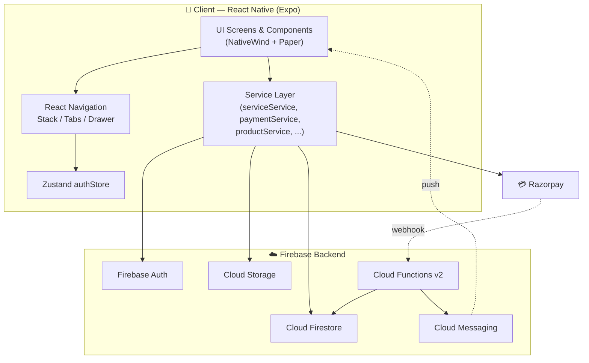

**Layered design**

- **Screens** render the UI and call into the **service layer**.
- The **service layer** (`src/services/*`) encapsulates all Firebase/Razorpay calls,
  keeping screens free of backend logic.
- **Zustand** holds the authenticated user and drives which navigator is shown.
- **Cloud Functions** run server-side jobs (expiry, reminders, payment webhook).

---

## 4. Development Phases

### Phase 1 — Planning & Requirements

**Goal:** Define the business domain, user roles, and feature set.

| Requirement | Decision |
|---|---|
| Two user roles | Customer & Admin, resolved from `users/{uid}.role` |
| Two product lines | Beauty **services** and boutique **products** |
| Audience split | `women` and `kids` catalogs |
| Payment options | Services = full payment; Products = pre-book or 4-instalments |
| Catalog source | Real menu/prices from the parlour |

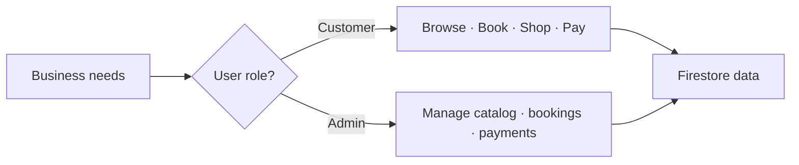

---

### Phase 2 — Project Setup & Tooling

**Goal:** Establish the Expo + Firebase + TypeScript foundation.

- Initialised an **Expo** project with TypeScript and the `src/` structure
  (`screens`, `components`, `services`, `navigation`, `store`, `types`, `constants`).
- Configured **NativeWind/Tailwind** and **React Native Paper** for styling.
- Set up **Firebase** via environment variables injected through
  [app.config.ts](../app.config.ts) `extra` (no secrets committed).
- Created **admin scripts** (`scripts/`) using `firebase-admin` to seed and maintain
  data (`seed`, `set-admin`, `replace-services`).

```text
src/
├── components/     reusable UI (cards, buttons, headers, rating)
├── navigation/     RootNavigator, CustomerTabs, AdminDrawer, AuthNavigator
├── screens/        auth/ · customer/ · admin/
├── services/       firebase + domain services (bookings, payments, products...)
├── store/          authStore (Zustand)
├── types/          shared TypeScript interfaces
└── constants/      colours, shadows, config
```

---

### Phase 3 — Authentication

**Goal:** Secure sign-up/sign-in and role-based routing.

- **Email/Password** and **Google** sign-in on the Login screen.
- On auth state change, the app loads `users/{uid}` and routes to the correct stack.
- **React Native persistence fix:** auth is initialised with
  `initializeAuth(app, { persistence: getReactNativePersistence(AsyncStorage) })` on
  native so sessions survive app restarts; `getAuth(app)` is used on web.

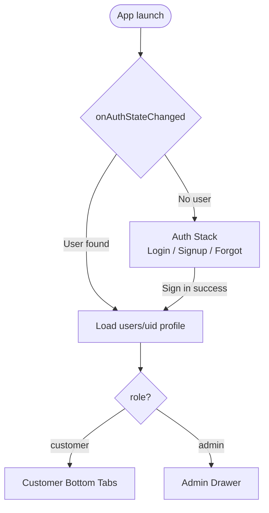

---

### Phase 4 — Customer Module

**Goal:** Browsing, booking, shopping, and history for customers.

**Bottom-tab navigation:** Home · Beauty · Boutique · Kids · Account.

| Area | Screens |
|---|---|
| Discovery | `HomeScreen`, `ServiceListScreen`, `ProductListScreen`, `KidsScreen` |
| Details | `ServiceDetailScreen`, `ProductDetailScreen` |
| Transactions | `BookingScreen`, `PreBookScreen`, `PaymentDetailScreen` |
| History | `MyBookingsScreen`, `MyPreOrdersScreen`, `MyPaymentsScreen`, `FeedbackHistoryScreen` |
| Other | `AccountScreen`, `NotificationScreen`, `FeedbackScreen` |

**Service booking flow**

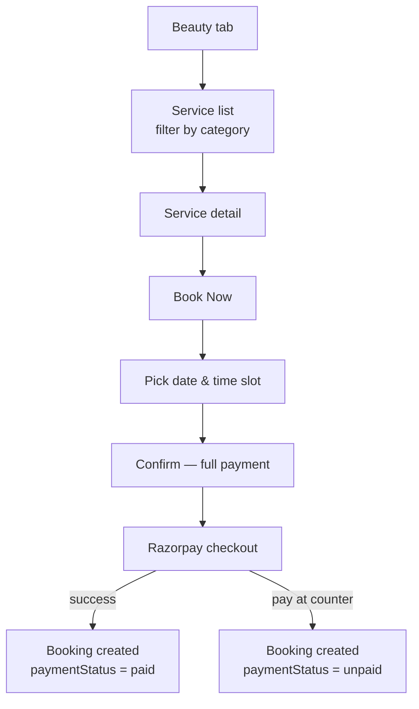

**Boutique purchase flow**

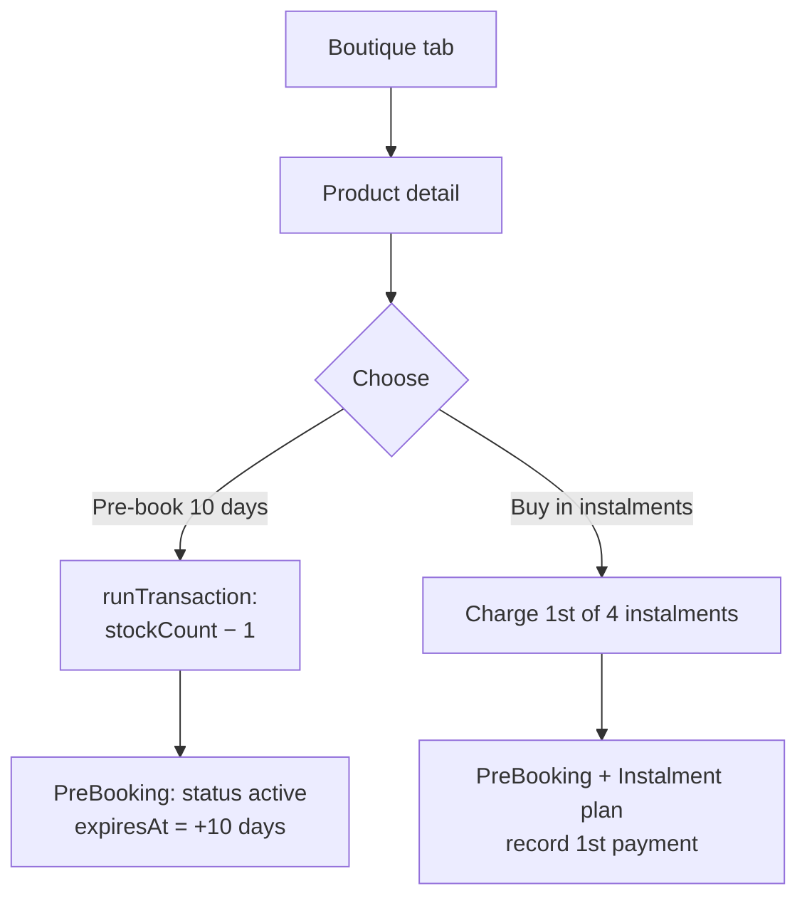

---

### Phase 5 — Payments & Instalments

**Goal:** Flexible, reliable online payments.

- **Razorpay** integration works on both **web** (checkout.js) and **native**
  (`react-native-razorpay`, lazy-loaded to avoid bundling issues).
- **Services** are **full payment only**.
- **Boutique products** support a **4-part instalment plan**
  (`maxInstalments = 4`); the plan records `instalmentAmount` and
  `numberOfInstalments`, and each payment is appended to the `instalments` array.
- A **Cloud Function webhook** verifies Razorpay signatures (HMAC SHA-256) and marks
  payments/bookings as paid server-side.

```mermaid
flowchart LR
    A[Customer pays] --> B[Razorpay checkout]
    B --> C[payment.captured event]
    C --> D[Cloud Function webhook<br/>verify HMAC signature]
    D --> E[payments/&#123;id&#125; → status paid]
    D --> F[booking/preBooking → paymentStatus paid]
```

---

### Phase 6 — Admin Module

**Goal:** Full back-office control via a drawer navigator.

| Screen | Purpose |
|---|---|
| `DashboardScreen` | Business overview |
| `ServicesScreen` | Create/edit/disable services |
| `ProductsScreen` | Manage boutique inventory |
| `AdminBookingsScreen` | View & update booking statuses |
| `AdminPaymentsScreen` | Track payments & instalments |
| `AdminPreOrdersScreen` | Manage pre-bookings |
| `CustomersScreen` | Customer directory |

- Admin access is granted via the `set-admin` script (custom role in Firestore).
- The drawer includes a pinned **Logout** action with a confirmation dialog.

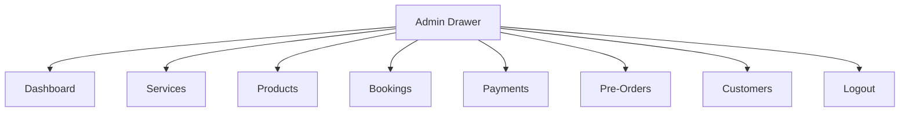

---

### Phase 7 — Cloud Functions & Notifications

**Goal:** Automate server-side jobs and engage customers.

Implemented in [functions/src/index.ts](../functions/src/index.ts):

1. **`expirePreBookings`** — scheduled daily (00:00 IST); marks expired
   pre-bookings (`status = expired`).
2. **`sendBookingReminder`** — scheduled hourly; sends an FCM push to customers
   whose confirmed booking is the next day.
3. **`razorpayWebhook`** — HTTPS endpoint; verifies the Razorpay signature and
   updates payment/booking status on `payment.captured`.

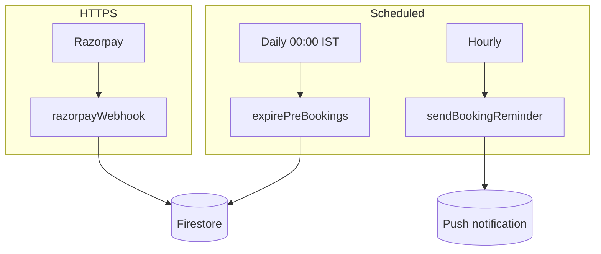

---

### Phase 8 — Testing & Deployment

**Goal:** Validate and ship the app.

- **Type safety:** full `tsc --noEmit` passes with zero errors.
- **Web preview:** verified flows on `localhost:8081`.
- **Device builds:** EAS cloud builds —
  - `development` — dev client (needs Metro server)
  - `preview` — standalone **APK** for free direct install/sharing
  - `production` — **AAB** for the Google Play Store
- **Firestore rules & indexes** deployed to the live project.
- **Distribution options:** free APK share (QR/link), web hosting, or Play Store.

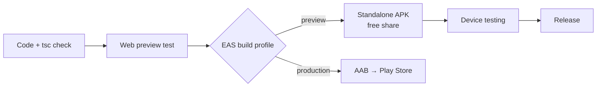

---

## 5. Data Model

Core Firestore collections (from [src/types/index.ts](../src/types/index.ts)):

| Collection | Key fields |
|---|---|
| `users` | `uid`, `name`, `email`, `phone`, `role`, `fcmToken` |
| `services` | `name`, `price`, `duration`, `category`, `audience`, `isActive` |
| `products` | `name`, `price`, `category`, `stockCount`, `audience`, `isActive` |
| `bookings` | `customerId`, `serviceId`, `date`, `timeSlot`, `status`, `paymentStatus` |
| `preBookings` | `customerId`, `productId`, `quantity`, `status`, `expiresAt` |
| `payments` | `referenceType`, `referenceId`, `totalAmount`, `paidAmount`, `instalments[]`, `paymentMode` |
| `feedback` | `customerId`, `serviceId`, `rating`, `comment` |

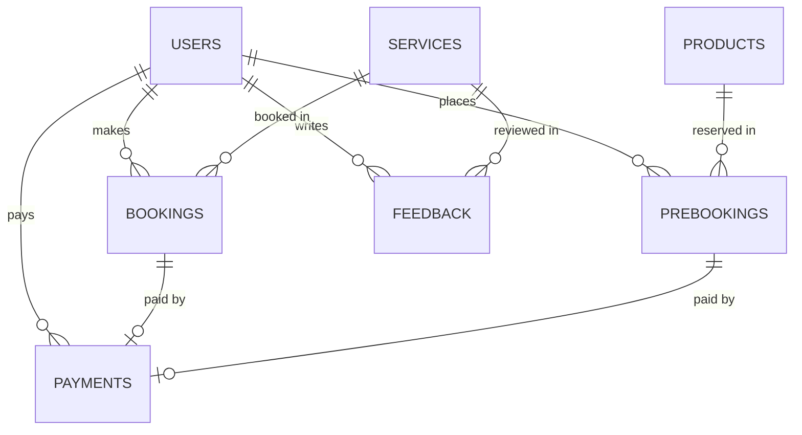

---

## 6. Screenshots

> Captured from the running web build. (Catalog image thumbnails are blocked by the
> browser's image policy in the local preview but load normally on device.)

### Authentication

| Login | Sign Up |
|---|---|
| 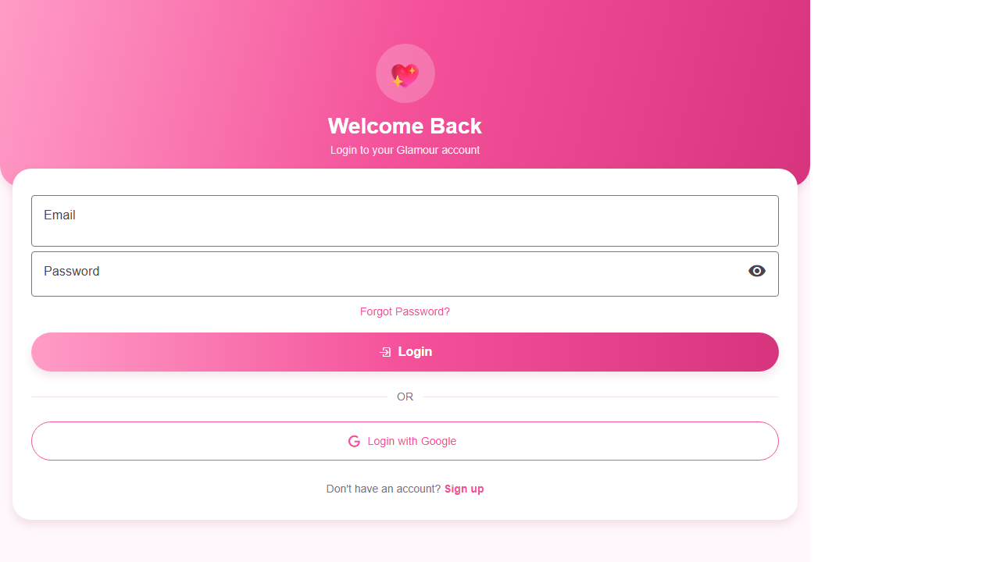 | 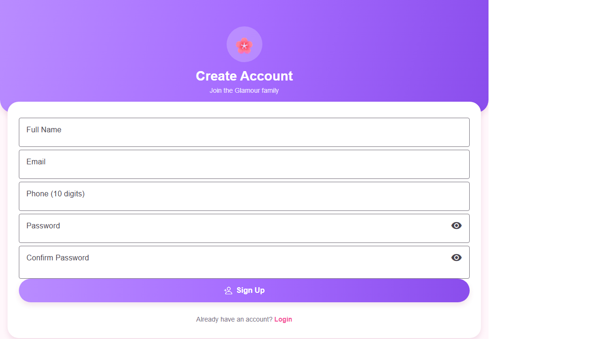 |

### Customer — Home & Catalogs

| Home | Beauty Services |
|---|---|
| 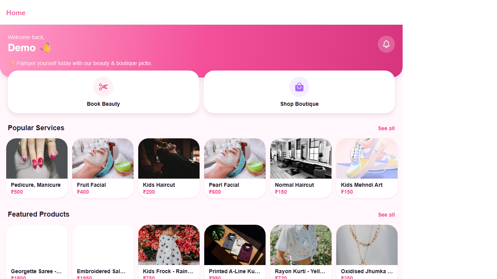 |  |

| Boutique | Kids Corner |
|---|---|
| 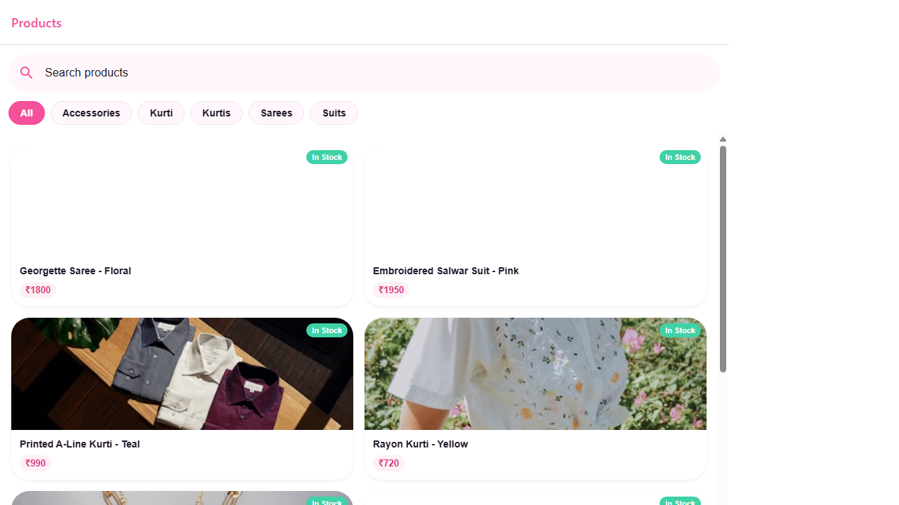 | 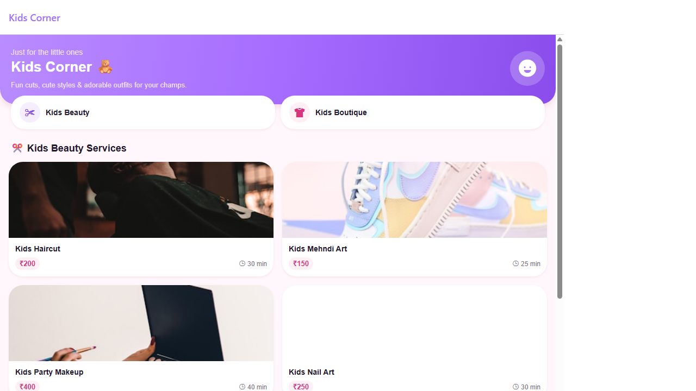 |

### Customer — Details & Account

| Service Detail (Book Now) | Account |
|---|---|
|  | 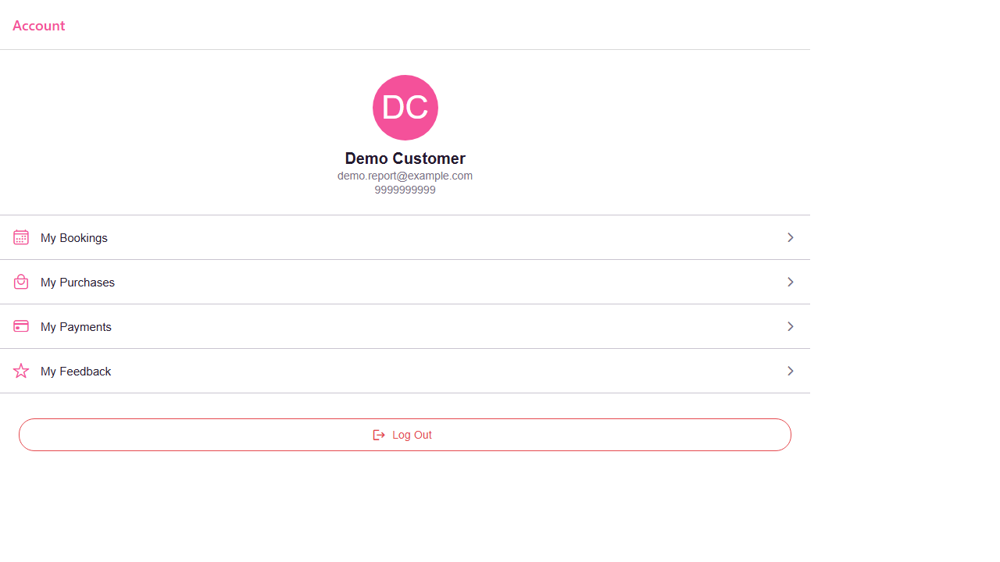 |

---

## 7. Security

- **Secrets are never committed.** `.env`, `google-services.json`, and
  `scripts/serviceAccountKey.json` are git-ignored; only `.env.example` (placeholder
  names) is in the repo.
- **Firestore Security Rules** enforce ownership: customers can only read/update their
  own bookings, pre-bookings, and payments, and may decrement product `stockCount` by
  exactly 1.
- **Razorpay key separation:** only the publishable **Key ID** is shipped in the app;
  the **Key Secret** / webhook secret stay server-side (Cloud Functions secrets).
- **Webhook verification** uses constant-time HMAC SHA-256 signature comparison.

---

## 8. Future Enhancements

- Complete **Google Sign-In on Android** (register OAuth client SHA-1 + client ID).
- Server-side **Razorpay order creation** for stronger payment integrity.
- **In-app notifications centre** and richer admin analytics/dashboards.
- **Search & filtering** improvements across catalogs.
- Publish to the **Google Play Store** (production AAB is build-ready).

---

*Generated as a structured project report for the Glamour Beauty & Boutique App.*
